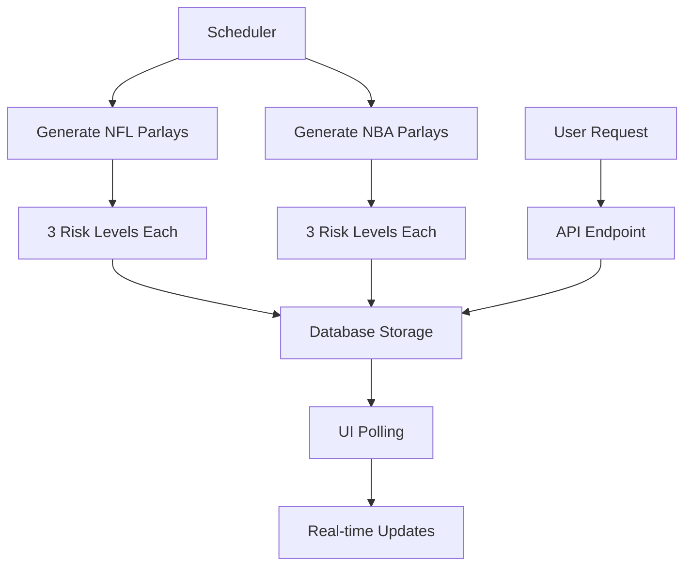

# 🔧 Backend Integration Q&A - NBA/NFL Parlay System

## 🌐 **Automated Parlay Endpoint Architecture**

### **Current Implementation: Separate Endpoints + Scheduler**

The backend uses **separate endpoints with intelligent scheduler coordination**:

```typescript
// Current API Structure
POST /generate-nfl-parlay    // Single NFL parlay generation
POST /generate-nba-parlay    // Single NBA parlay generation
POST /manual-trigger         // Triggers automated generation for both sports
```

### **Scheduler Behavior on Multi-Sport Days**

The `MultiSportSchedulerIntegration` handles this intelligently:

```python
# On days with both sports, scheduler makes separate calls:
await self._generate_nfl_parlays(game_day, game_time)  # Generates 3 NFL parlays
await self._generate_nba_parlays(game_day, game_time)  # Generates 3 NBA parlays

# Risk configurations for each sport:
NFL_CONFIGS = [
    {"target_legs": 2, "min_odds": 3.0, "name": "Conservative"},
    {"target_legs": 3, "min_odds": 5.0, "name": "Moderate"}, 
    {"target_legs": 4, "min_odds": 10.0, "name": "Aggressive"}
]

NBA_CONFIGS = [
    {"target_legs": 2, "min_odds": 3.0, "name": "Conservative"},
    {"target_legs": 3, "min_odds": 5.0, "name": "Moderate"},
    {"target_legs": 4, "min_odds": 8.0, "name": "Aggressive"}
]
```

### **Recommended UI Approach**

For your frontend, implement a **unified generation endpoint wrapper**:

```typescript
// Frontend API wrapper
interface AutomatedParlayRequest {
  sports: ('nfl' | 'nba')[];
  generate_all_risk_levels?: boolean;
}

export const generateAutomatedParlays = async (
  request: AutomatedParlayRequest
): Promise<AutomatedParlayResponse> => {
  const parlays: ParlayResponse[] = [];
  
  for (const sport of request.sports) {
    // Generate 3 parlays per sport (different risk levels)
    const riskConfigs = getRiskConfigsForSport(sport);
    
    for (const config of riskConfigs) {
      const parlay = await generateParlay(sport, config);
      if (parlay.success) {
        parlays.push({
          ...parlay,
          generation_type: 'automated',
          risk_profile: config.name.toLowerCase(),
          sport_type: sport.toUpperCase()
        });
      }
    }
  }
  
  return { parlays, total_generated: parlays.length };
};
```

---

## 📊 **Parlay Metadata & Data Models**

### **Current Database Schema (from BetsLogger)**

```sql
-- Actual database structure
CREATE TABLE bets (
    bet_id INTEGER PRIMARY KEY AUTOINCREMENT,
    game_id TEXT NOT NULL,
    parlay_id TEXT NOT NULL,
    leg_description TEXT NOT NULL,
    odds REAL NOT NULL,
    stake REAL NOT NULL,
    predicted_outcome TEXT NOT NULL,
    actual_outcome TEXT,
    is_win INTEGER,
    created_at TEXT NOT NULL,
    updated_at TEXT NOT NULL,
    odds_at_alert REAL,
    closing_line_odds REAL,
    clv_percentage REAL,
    sport TEXT DEFAULT 'nba'  -- Explicit sport field
);
```

### **Recommended Extended Parlay Model**

```typescript
interface ExtendedParlayResponse {
  // Core parlay data
  success: boolean;
  sport: "NFL" | "NBA";
  parlay: {
    parlay_id: string;              // Unique identifier
    legs: ParlayLeg[];
    confidence: number;
    expected_value?: number;
    kelly_percentage?: number;
    reasoning: string;
  };
  
  // Metadata for UI
  generation_type: "automated" | "user_requested" | "manual_trigger";
  risk_profile?: "conservative" | "moderate" | "aggressive";
  sport_type: "NFL" | "NBA";
  created_at: string;
  agent_version: string;
  
  // Automated parlay specific
  trigger_info?: {
    game_day: string;           // "sunday", "thursday"
    game_time: string;          // "13:00", "20:20"
    scheduled_time: string;     // ISO timestamp of generation
  };
  
  // User request specific
  user_request?: {
    custom_parameters: ParlayRequest;
    user_id?: string;
  };
}
```

### **GET /parlays Endpoint Design**

```typescript
// Recommended endpoint for fetching parlays
GET /parlays?source=automated&sport=nfl&since=2024-01-01T00:00:00Z&limit=10

interface ParlaysResponse {
  parlays: ExtendedParlayResponse[];
  total_count: number;
  filters_applied: {
    source?: "automated" | "user_requested";
    sport?: "nfl" | "nba";
    since?: string;
    risk_profile?: string;
  };
  pagination: {
    limit: number;
    offset: number;
    has_more: boolean;
  };
}
```

---

## 👤 **User Limits & Usage Tracking**

### **Recommended User Usage API**

```typescript
// User usage endpoint
GET /users/me/usage

interface UserUsageResponse {
  user_tier: "free" | "pro" | "enterprise";
  current_period: {
    start_date: string;
    end_date: string;
    period_type: "daily" | "monthly";
  };
  limits: {
    parlay_requests_per_day: number;    // Free: 2, Pro: 50, Enterprise: unlimited
    knowledge_searches_per_day: number; // Free: 10, Pro: 100, Enterprise: unlimited
    arbitrage_alerts: boolean;           // Free: false, Pro: true, Enterprise: true
  };
  usage: {
    parlays_requested_today: number;
    knowledge_searches_today: number;
    last_parlay_request: string;        // ISO timestamp
  };
  remaining: {
    parlay_requests: number | "unlimited";
    knowledge_searches: number | "unlimited";
  };
}
```

### **UI Implementation for Limits**

```tsx
const ParlayGeneratorForm = () => {
  const { data: usage } = useQuery('user-usage', getUserUsage, {
    refetchInterval: 60000 // Refresh every minute
  });
  
  const canGenerateParlay = usage?.remaining.parlay_requests !== 0;
  const isUnlimited = usage?.remaining.parlay_requests === "unlimited";
  
  return (
    <div className="space-y-4">
      {/* Usage indicator */}
      {!isUnlimited && (
        <div className="bg-gray-800 p-3 rounded">
          <div className="flex justify-between items-center">
            <span className="text-sm">Daily Parlays</span>
            <span className={`text-sm ${canGenerateParlay ? 'text-green-400' : 'text-red-400'}`}>
              {usage?.remaining.parlay_requests} remaining
            </span>
          </div>
          <div className="mt-2 bg-gray-700 rounded-full h-2">
            <div 
              className="bg-blue-500 h-2 rounded-full"
              style={{ 
                width: `${((usage?.limits.parlay_requests_per_day - usage?.remaining.parlay_requests) / usage?.limits.parlay_requests_per_day) * 100}%` 
              }}
            />
          </div>
        </div>
      )}
      
      {/* Generation form */}
      <button 
        disabled={!canGenerateParlay}
        className={`btn ${canGenerateParlay ? 'btn-primary' : 'btn-disabled'}`}
      >
        {canGenerateParlay ? 'Generate Parlay' : 'Daily Limit Reached'}
      </button>
      
      {/* Upgrade prompt */}
      {!canGenerateParlay && usage?.user_tier === 'free' && (
        <div className="bg-yellow-900 border border-yellow-600 p-3 rounded">
          <p className="text-sm text-yellow-200">
            Upgrade to Pro for 50 parlays/day and arbitrage alerts
          </p>
          <button className="btn-secondary mt-2">Upgrade Now</button>
        </div>
      )}
    </div>
  );
};
```

---

## ⚡ **Real-Time Features Implementation**

### **Current Backend Capabilities**

The backend supports **polling-based real-time updates** (no WebSockets currently):

```typescript
// Recommended polling intervals
const POLLING_INTERVALS = {
  health_check: 30000,        // 30 seconds
  system_stats: 60000,        // 1 minute  
  new_parlays: 120000,        // 2 minutes
  odds_updates: 60000,        // 1 minute
  scheduled_jobs: 300000      // 5 minutes
};
```

### **Real-Time Parlay Updates**

```tsx
// Automated parlay feed with polling
const AutomatedParlayFeed = () => {
  const [lastUpdate, setLastUpdate] = useState(new Date().toISOString());
  
  const { data: newParlays, isLoading } = useQuery(
    ['automated-parlays', lastUpdate],
    () => fetchParlays({ 
      source: 'automated', 
      since: lastUpdate,
      sport: 'all'
    }),
    {
      refetchInterval: 120000, // 2 minutes
      onSuccess: (data) => {
        if (data.parlays.length > 0) {
          setLastUpdate(new Date().toISOString());
          // Show notification for new parlays
          showNotification(`${data.parlays.length} new automated parlays available`);
        }
      }
    }
  );
  
  return (
    <div className="space-y-4">
      {isLoading && <LoadingIndicator />}
      {newParlays?.parlays.map(parlay => (
        <ParlayCard 
          key={parlay.parlay.parlay_id}
          parlay={parlay}
          isNew={true}
        />
      ))}
    </div>
  );
};
```

### **Odds Data Updates in Parlay Drawer**

```tsx
const ParlaySlipDrawer = ({ parlay, isOpen }) => {
  const [oddsStale, setOddsStale] = useState(false);
  
  // Check odds freshness every minute when drawer is open
  useEffect(() => {
    if (!isOpen) return;
    
    const interval = setInterval(async () => {
      const freshOdds = await checkOddsFreshness(parlay.parlay.legs);
      setOddsStale(freshOdds.some(leg => leg.price_changed));
    }, 60000);
    
    return () => clearInterval(interval);
  }, [isOpen, parlay]);
  
  return (
    <Drawer isOpen={isOpen}>
      {oddsStale && (
        <div className="bg-yellow-900 border border-yellow-600 p-3 rounded mb-4">
          <div className="flex items-center space-x-2">
            <AlertIcon className="text-yellow-400" />
            <span className="text-yellow-200">Odds may have changed</span>
            <button 
              onClick={() => refreshParlay(parlay.parlay.parlay_id)}
              className="btn-secondary btn-sm"
            >
              Refresh
            </button>
          </div>
        </div>
      )}
      {/* Parlay content */}
    </Drawer>
  );
};
```

---

## 🎨 **User Experience (UX) Design**

### **Quick Parlay vs Custom Parlay**

```tsx
// Dashboard Quick Parlay Widget
const QuickParlayWidget = () => {
  const generateQuickParlay = async (sport: 'nfl' | 'nba') => {
    // One-click generation with default settings
    return await generateParlay(sport, {
      target_legs: 3,
      min_total_odds: 5.0,
      include_arbitrage: true
    });
  };
  
  return (
    <div className="bg-gray-800 p-4 rounded-lg">
      <h3 className="text-lg font-semibold mb-4">Quick Generate</h3>
      <div className="space-y-2">
        <button 
          onClick={() => generateQuickParlay('nfl')}
          className="btn-primary w-full"
        >
          🏈 NFL Parlay (3 legs, 5.0+ odds)
        </button>
        <button 
          onClick={() => generateQuickParlay('nba')}
          className="btn-primary w-full"
        >
          🏀 NBA Parlay (3 legs, 5.0+ odds)
        </button>
      </div>
    </div>
  );
};

// Full Parlay Generator Page
const CustomParlayGenerator = () => {
  return (
    <div className="space-y-6">
      <h1>Custom Parlay Generator</h1>
      
      {/* Sport Selection */}
      <SportTabs />
      
      {/* Parameter Controls */}
      <div className="grid grid-cols-1 md:grid-cols-3 gap-4">
        <LegCountSlider min={2} max={5} />
        <OddsRangeSlider min={2.0} max={20.0} />
        <ArbitrageToggle />
      </div>
      
      {/* Advanced Options */}
      <AdvancedOptionsAccordion>
        <RiskProfileSelector />
        <MarketTypeFilters />
        <BookmakerPreferences />
      </AdvancedOptionsAccordion>
      
      <GenerateButton />
    </div>
  );
};
```

### **Empty States for No Games**

```tsx
const SportParlaySection = ({ sport }: { sport: 'nfl' | 'nba' }) => {
  const { data: gamesSchedule } = useQuery(
    ['games-schedule', sport],
    () => getGamesSchedule(sport)
  );
  
  const hasGamesToday = gamesSchedule?.games_today?.length > 0;
  const nextGameDate = gamesSchedule?.next_game_date;
  
  if (!hasGamesToday) {
    return (
      <div className="bg-gray-800 p-8 rounded-lg text-center">
        <div className="text-6xl mb-4">
          {sport === 'nfl' ? '🏈' : '🏀'}
        </div>
        <h3 className="text-xl font-semibold mb-2">
          No {sport.toUpperCase()} Games Today
        </h3>
        <p className="text-gray-400 mb-4">
          {nextGameDate ? (
            `Next ${sport.toUpperCase()} games: ${formatDate(nextGameDate)}`
          ) : (
            `${sport.toUpperCase()} season is currently inactive`
          )}
        </p>
        
        {/* Show recent automated parlays if available */}
        <div className="mt-6">
          <button className="btn-secondary">
            View Recent {sport.toUpperCase()} Parlays
          </button>
        </div>
      </div>
    );
  }
  
  return <ParlayGeneratorForm sport={sport} />;
};

// Automated parlay feed empty state
const AutomatedParlayFeedEmptyState = ({ sport }: { sport: 'nfl' | 'nba' }) => {
  return (
    <div className="bg-gray-800 p-6 rounded-lg border-2 border-dashed border-gray-600">
      <div className="text-center">
        <ClockIcon className="mx-auto h-12 w-12 text-gray-400 mb-4" />
        <h3 className="text-lg font-medium mb-2">
          No Automated {sport.toUpperCase()} Parlays Yet
        </h3>
        <p className="text-gray-400 text-sm mb-4">
          Automated parlays are generated 3 hours before game time
        </p>
        <div className="space-x-2">
          <button className="btn-secondary btn-sm">
            Generate Manual Parlay
          </button>
          <button className="btn-ghost btn-sm">
            View Schedule
          </button>
        </div>
      </div>
    </div>
  );
};
```

---

## 🔄 **Recommended Implementation Workflow**

### **Phase 1: Core Functionality**
1. Implement basic parlay generation with existing endpoints
2. Add user usage tracking and limits
3. Create polling-based real-time updates
4. Build empty states and error handling

### **Phase 2: Enhanced Features**
1. Add automated parlay feed with metadata
2. Implement odds staleness detection
3. Create advanced filtering and search
4. Add export and sharing capabilities

### **Phase 3: Optimization**
1. Implement caching strategies for frequent requests
2. Add WebSocket support for true real-time updates
3. Create mobile-optimized components
4. Add analytics and user behavior tracking

### **Data Flow Summary**



This architecture provides a robust foundation for your UI while maintaining flexibility for future enhancements and ensuring optimal user experience across all tiers and usage patterns.

